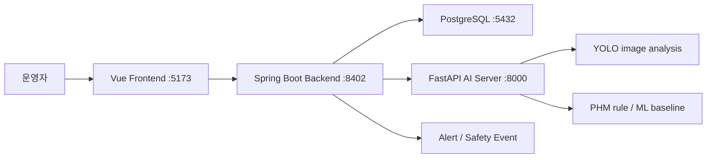
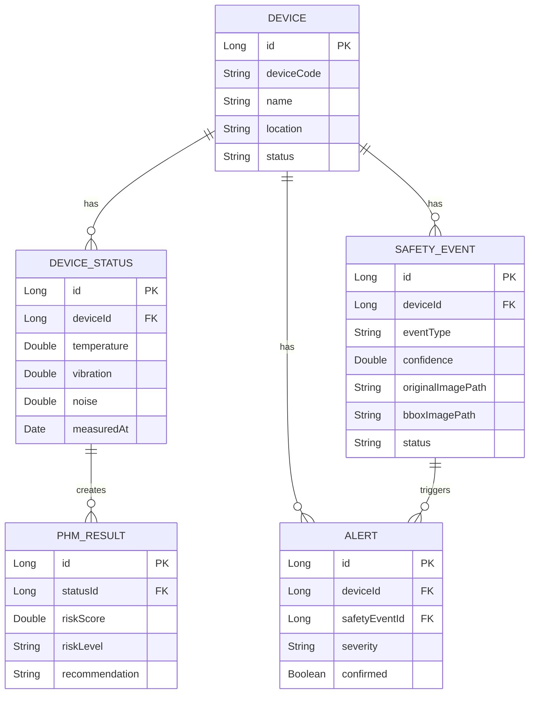

# IAT AI Safety System

인천공항 무인 셔틀 운영 환경을 가정해 장비 센서 데이터, 이미지 기반 안전 이벤트, 알림 이력, PHM 분석 결과를 통합 관제하는 개인 포트폴리오 프로젝트입니다. AI 모델 자체보다 분석 결과를 운영자가 확인하고 조치할 수 있는 관제 흐름으로 연결하는 데 초점을 두었습니다.

## 1. 프로젝트 개요

- 프로젝트명: IAT AI Safety System
- 개발 형태: 개인 확장 프로젝트
- 도메인: 무인 셔틀 장비 상태 모니터링, 안전 이벤트 관제, PHM 예지보전
- 구조: Vue frontend, Spring Boot backend, FastAPI AI server, PostgreSQL, Docker Compose
- 저장소: https://github.com/woongpro416/iat-ai-phm-personal

## 2. 주요 기능

- Home 화면에서 프로젝트 목적과 관제 메뉴 제공
- Dashboard에서 장비 수, 위험 장비, 미확인 알림, 미처리 이벤트 요약
- Device Status에서 온도, 진동, 소음 기반 상태 로그 등록
- PHM rule baseline으로 위험도, 상태, 분석 근거, 권장 조치 생성
- Safety Events에서 이미지 업로드 후 YOLO 객체 탐지 결과 저장
- 원본 이미지와 bbox 분석 이미지를 분리 저장하고 화면에서 함께 표시
- Alerts에서 장비 위험 알림과 안전 이벤트 알림 통합 조회
- PHM 학습 데이터 계약, time-aware split, rolling feature, RandomForest baseline 학습/평가

## 3. 담당 역할

- Vue 관제 화면과 Spring Boot device/status/safety/alert API 데이터 흐름 구성
- Spring Boot에서 FastAPI 분석 결과를 안전 이벤트와 PHM 결과로 저장하는 연동 구조 구현
- 장비 온도/진동/소음 기반 PHM rule baseline 결과 저장 흐름 검증
- 이미지 업로드 → YOLO 분석 → 원본/bbox 이미지 분리 저장 → 화면 표시 흐름 구현
- PHM 학습 데이터 계약, time-aware split, rolling feature, RandomForest baseline 평가 파이프라인 정리

## 4. 기술 스택

| 영역 | 기술 | 역할 |
| --- | --- | --- |
| Frontend | Vue 3, Vite, Bootstrap, Axios | 관제 화면, 상태/이벤트/알림 관리 |
| Backend | Spring Boot 3, JPA, Validation, RestClient | API, 비즈니스 로직, DB 저장, AI 서버 연동 |
| AI Server | FastAPI, OpenCV, Ultralytics, scikit-learn | PHM 분석, YOLO 이미지 분석, ML baseline 학습 |
| Database | PostgreSQL | 장비, 상태 로그, 안전 이벤트, 알림 저장 |
| Infra | Docker Compose | 로컬 통합 실행 |

## 5. 시스템 아키텍처



## 6. ERD



실제 entity는 `backend/src/main/java/...` 기준입니다. README ERD는 핵심 관계 요약입니다.

## 7. API 명세

| 도메인 | 주요 API |
| --- | --- |
| Device | 장비 등록, 목록 조회, 상세 조회 |
| Device Status | 상태 로그 등록, PHM 분석 결과 저장/조회 |
| Safety Event | 이미지 업로드, YOLO 분석 요청, 이벤트 조회/상태 변경 |
| Alert | 알림 목록 조회, 미확인/확인 완료 탭, 알림 확인 처리 |
| AI Server | PHM rule baseline 분석, YOLO 이미지 분석, ML baseline 학습 산출물 |

주요 URL:

- Frontend: http://localhost:5173
- Dashboard: http://localhost:5173/dashboard
- Spring Swagger: http://localhost:8402/swagger-ui/index.html
- FastAPI Docs: http://localhost:8000/docs

## 8. 실행 방법

전체 실행:

```powershell
docker compose -f docker-compose.yml -f docker-compose.dev.yml up -d --build
```

최근 변경 서비스만 재빌드:

```powershell
docker compose -f docker-compose.yml -f docker-compose.dev.yml up -d --build ai-server backend frontend
```

상태 확인:

```powershell
docker compose -f docker-compose.yml -f docker-compose.dev.yml ps
```

시연 데이터 생성:

```powershell
.\scripts\seed-dashboard-demo-data.ps1
```

## 9. 테스트 / 검증 방법

Python 경량 테스트:

```powershell
python -m unittest discover ai-server\tests
```

문법/공백 확인:

```powershell
python -m py_compile ai-server\main.py ai-server\training\phm_baseline_trainer.py
git diff --check
```

PHM baseline 학습:

```powershell
cd ai-server
python -m training.phm_sample_dataset_generator --output-path datasets/phm/sample_phm_training.csv
python -m training.phm_baseline_trainer datasets/phm/sample_phm_training.csv --artifact-path model_artifacts/phm/phm_rf_v1.joblib --report-path ../docs/phm-baseline-report.md
```

화면 검증:

- Dashboard 요약 카드와 차트 표시 확인
- Device Status 등록 후 PHM 결과 저장 확인
- Safety Events 이미지 업로드 후 원본/bbox 이미지 표시 확인
- Alerts 미확인/확인 완료 상태 변경 확인

## 10. 트러블슈팅

- AI 모델 자체보다 운영자가 확인하고 조치할 수 있는 관제 흐름으로 연결하는 데 초점을 두었습니다.
- PHM ML baseline은 운영 API 교체가 아니라 학습/평가 파이프라인 산출물로 설명하도록 범위를 명확히 했습니다.
- 샘플 데이터는 포트폴리오 시연용 합성 데이터이며 실제 현장 성능으로 해석하지 않도록 README에 명시했습니다.
- 이미지 업로드 시 빈 파일/비이미지 파일을 방어하고, 원본 이미지와 bbox 결과 이미지를 분리 저장했습니다.
- 모델 버전, prediction horizon, feature별 위험 기여도, threshold 위반 근거를 화면에 표시해 분석 근거를 남겼습니다.

## 11. 배포 / 링크

- GitHub: https://github.com/woongpro416/iat-ai-phm-personal
- DockerHub Frontend: https://hub.docker.com/r/devwoong416/iat-ai-safety-frontend
- DockerHub Backend: https://hub.docker.com/r/devwoong416/iat-ai-safety-backend
- DockerHub AI Server: https://hub.docker.com/r/devwoong416/iat-ai-safety-ai-server
- Spring Swagger(local): http://localhost:8402/swagger-ui/index.html
- FastAPI Docs(local): http://localhost:8000/docs

## 12. 한계와 개선 방향

- 샘플 데이터는 합성 데이터이므로 실제 현장 성능으로 해석할 수 없습니다.
- PHM baseline은 rule 기반 운영 흐름과 ML 학습 파이프라인을 보여주는 단계입니다.
- 실제 운영 적용에는 장비별 임계값 튜닝, 장기간 데이터 수집, 알림 정책 고도화가 필요합니다.
- 향후 인증/권한, 배포 자동화, 장애 알림, 모델 버전 관리, 테스트 자동화를 강화할 수 있습니다.