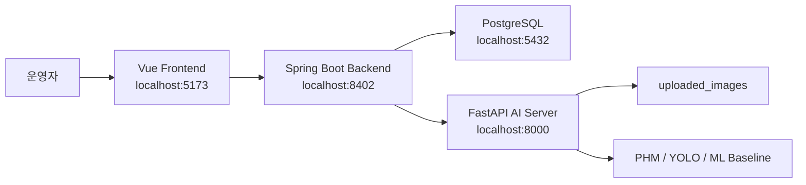

# IAT AI Safety System

AI 기반 무인 셔틀 장비 상태 모니터링 및 실시간 안전 관제 웹 시스템입니다.

인천공항 무인 셔틀 운영 환경을 가정해 장비 센서 데이터, 이미지 기반 안전 이벤트, 알림 이력, PHM 분석 결과를 통합 관제하는 개인 포트폴리오 프로젝트입니다.

## 핵심 포인트

- Vue 3 관제 화면, Spring Boot API, FastAPI AI 서버, PostgreSQL을 Docker Compose로 연동
- 장비 온도/진동/소음 입력 후 PHM rule baseline으로 위험도, 상태, 분석 근거, 권장 조치 생성
- 이미지 업로드 후 YOLO 기반 객체 탐지 결과를 안전 이벤트로 저장
- 원본 이미지와 bbox 분석 이미지를 분리 저장하고 화면에서 함께 표시
- 대시보드에서 장비 상태, 최근 위험도, 안전 이벤트, 알림을 통합 조회
- `/` Home 화면과 전용 파비콘을 적용해 포트폴리오 첫인상 보강
- PHM 학습 데이터 계약, time-aware split, rolling feature, RandomForest baseline 학습/평가 파이프라인 작성

## 기술 스택

| 영역 | 기술 | 역할 |
| --- | --- | --- |
| Frontend | Vue 3, Vite, Bootstrap, Axios | 관제 화면, 대시보드, 상태/이벤트/알림 관리 |
| Backend | Spring Boot 3, JPA, Validation, RestClient | API, 비즈니스 로직, DB 저장, AI 서버 연동 |
| AI Server | FastAPI, OpenCV, Ultralytics, scikit-learn | PHM 분석, YOLO 이미지 분석, ML baseline 학습 |
| Database | PostgreSQL | 장비, 상태 로그, 안전 이벤트, 알림 저장 |
| Infra | Docker Compose | 로컬 통합 실행 |

## 주요 기능

### Home

- `/` 진입 시 프로젝트 목적과 주요 관제 메뉴 표시
- Dashboard, Device Status, Safety Events, Alerts로 바로 이동
- 셔틀 운행 관제 지표와 최근 위험도 흐름을 시각화
- 프로젝트 전용 favicon 적용

### Dashboard

- 전체 장비, 주의/위험 장비, 미확인 알림, 미처리 안전 이벤트 요약
- 최근 위험도 변화 차트
- 상태별 장비 수 차트
- 최근 알림, 안전 이벤트, 장비 상태 로그 표시
- 10초 자동 갱신과 수동 새로고침

### Device Status

- 장비 등록
- 온도, 진동, 소음 기반 상태 로그 등록
- PHM rule baseline 분석 결과 저장
- 모델 버전, prediction horizon, feature별 위험 기여도, threshold 위반 근거, 권장 조치 표시
- 입력값 validation 오류 메시지 표시

### Safety Events

- 장비별 이미지 업로드
- FastAPI YOLO 분석 요청
- 원본 이미지와 bbox 결과 이미지 저장
- 이벤트 유형, 신뢰도, 처리 상태 관리
- 상세 모달에서 detection class, confidence, bbox 좌표 확인
- 빈 파일/비이미지 파일 업로드 방어

### Alerts

- 장비 위험 알림과 안전 이벤트 알림 통합 조회
- 미확인/확인 완료 탭 분리
- 중요도 표시
- 알림 확인 처리
- 상세 모달에서 운영자용 메시지와 원본 메시지 구분

### PHM ML Baseline

- 학습 데이터 계약 문서화
- `deviceId + sampledAt` grain 검증
- timezone 포함 ISO-8601 timestamp 검증
- `failureWithinHorizon` 이진 라벨 검증
- 장비별 rolling mean/std feature 생성
- 시간 순서 기반 train/validation/test split과 prediction horizon purge
- RandomForest baseline 학습, 평가 리포트, 모델 artifact 생성

## 시스템 구조



## 실행

전체 실행:

```powershell
docker compose -f docker-compose.yml -f docker-compose.dev.yml up -d --build
```

최근 변경 서비스만 재빌드:

```powershell
docker compose -f docker-compose.yml -f docker-compose.dev.yml up -d --build ai-server backend frontend
```

상태 확인:

```powershell
docker compose -f docker-compose.yml -f docker-compose.dev.yml ps
```

## 주요 URL

- Frontend: http://localhost:5173
- Dashboard: http://localhost:5173/dashboard
- Spring Swagger: http://localhost:8402/swagger-ui/index.html
- FastAPI Docs: http://localhost:8000/docs

## 시연 데이터 생성

```powershell
.\scripts\seed-dashboard-demo-data.ps1
```

## PHM baseline 학습

샘플 PHM 학습 CSV 재생성:

```powershell
cd ai-server
python -m training.phm_sample_dataset_generator `
  --output-path datasets/phm/sample_phm_training.csv
```

RandomForest baseline 학습 및 리포트 생성:

```powershell
python -m training.phm_baseline_trainer `
  datasets/phm/sample_phm_training.csv `
  --artifact-path model_artifacts/phm/phm_rf_v1.joblib `
  --report-path ../docs/phm-baseline-report.md
```

현재 생성된 산출물:

- `ai-server/datasets/phm/sample_phm_training.csv`
- `ai-server/model_artifacts/phm/phm_rf_v1.joblib`
- `docs/phm-baseline-report.md`
- `docs/phm-baseline-comparison.md`

샘플 데이터는 포트폴리오 시연용 합성 데이터이며 실제 현장 성능으로 해석하지 않습니다.

## 검증

Python 경량 테스트:

```powershell
python -m unittest discover ai-server\tests
```

문법/공백 확인:

```powershell
python -m py_compile ai-server\main.py ai-server\training\phm_baseline_trainer.py
git diff --check
```

## 문서

- [프로젝트 문서 초안](./docs/project-documentation-draft.md)
- [대시보드 점검 체크리스트](./docs/dashboard-checklist.md)
- [PHM 학습 데이터 계약](./docs/phm-training-data-contract.md)
- [PHM baseline 평가 리포트](./docs/phm-baseline-report.md)
- [PHM baseline 비교 문서](./docs/phm-baseline-comparison.md)
- [트러블슈팅 가이드](./docs/troubleshooting.md)
- [2026-06-24 작업일지](./study/work-log-2026-06-24.md)
- [오후 작업 TODO](./documents/artifact03_TODO.md)

## 마감 기준

현재 단계에서는 추가 고도화보다 build 후 smoke test, 주요 화면 캡처, 시연 순서 확정이 우선입니다.
PHM ML baseline은 운영 API 교체가 아니라 학습/평가 파이프라인 산출물로 설명합니다.

## 면접 설명 요약

이 프로젝트는 AI 모델 자체보다 AI 분석 결과를 운영자가 확인하고 조치할 수 있는 관제 흐름으로 연결한 점이 핵심입니다.

장비 상태 데이터는 PHM baseline을 통해 위험도, 근거, 권장 조치로 저장하고, 이미지 분석 결과는 원본/bbox 이미지와 함께 안전 이벤트로 관리합니다. 이후 PHM 학습 데이터 계약과 time-aware split 기반 ML baseline까지 작성해 rule 기반 운영 흐름에서 실제 학습 모델로 확장 가능한 구조를 보여줍니다.
