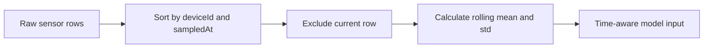
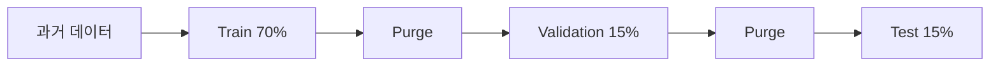

# PHM 학습 데이터 계약

## 1. 목적

현재 `phm-rule-baseline-v1`을 실제 학습 모델로 교체하기 전에 학습 데이터의
한 행, 필수 필드, 라벨, 결측 처리 기준을 고정한다.

이번 단계에서는 모델을 학습하지 않는다. 이 문서는 이후 데이터 수집,
전처리, 학습 코드가 동일한 기준을 사용하기 위한 계약이다.

## 2. 데이터 grain

학습 데이터 한 행은 다음을 의미한다.

```text
특정 장비(deviceId)의 특정 측정 시각(sampledAt)에 수집된 센서 상태
```

행의 고유키:

```text
deviceId + sampledAt
```

같은 장비와 같은 측정 시각의 데이터가 두 건 이상 존재하면 중복으로
처리한다.

## 3. 원본 데이터 스키마

| 필드 | 타입 | 필수 | 설명 |
| --- | --- | --- | --- |
| `deviceId` | long | O | 장비 식별자 |
| `sampledAt` | ISO-8601 timestamp | O | 센서가 실제 측정된 시각 |
| `temperature` | double | O | 온도 센서값 |
| `vibration` | double | O | 진동 센서값 |
| `noise` | double | O | 소음 센서값 |
| `failureWithinHorizon` | boolean | O | 측정 이후 예측 구간 안에 실제 고장이 발생했는지 여부 |
| `failureAt` | ISO-8601 timestamp | X | 실제 고장 시각. lead time 계산에 사용 |

예시:

```csv
deviceId,sampledAt,temperature,vibration,noise,failureWithinHorizon,failureAt
1,2026-06-01T09:00:00+09:00,38.2,0.21,49.3,false,
1,2026-06-01T10:00:00+09:00,62.7,0.93,77.1,true,2026-06-01T18:00:00+09:00
```

`sampledAt`은 DB 저장 시각인 `createdAt`과 구분한다. 네트워크 지연이나
재전송이 발생하면 센서 측정 시각과 서버 저장 시각이 달라질 수 있기
때문이다.

## 4. 라벨 정의

학습 라벨:

```text
failureWithinHorizon
```

- `true`: `sampledAt` 이후 prediction horizon 안에 실제 고장이 발생
- `false`: 같은 구간 안에 실제 고장이 발생하지 않음

초기 prediction horizon 후보는 24시간으로 둔다. 실제 장비의 측정 주기와
정비 대응 시간을 확인한 뒤 확정해야 한다.

현재 rule baseline의 센서 threshold로 학습 라벨을 만들지 않는다.
threshold 결과를 정답으로 사용하면 새 모델이 기존 규칙만 복제하게 되고,
실제 고장 예측 성능을 평가할 수 없다.

## 5. 파생 feature

원본 데이터에서 다음 feature를 장비별로 계산한다.

```text
temperature rolling mean / std
vibration rolling mean / std
noise rolling mean / std
```

rolling feature는 현재 행을 제외한 이전 센서값만 사용한다.



현재 행이나 미래 행을 rolling 계산에 포함하면 학습 시점에 알 수 없는
정보를 사용하는 데이터 누수가 발생한다.

## 6. 결측 및 이상 데이터 정책

- 필수 필드가 비어 있는 행은 임의의 0으로 대체하지 않는다.
- 결측 행은 별도 집계한 뒤 제거 또는 보정 여부를 결정한다.
- rolling mean 또는 std가 준비되지 않은 장비별 초기 행은 학습에서 제외한다.
- 제외 행에는 부족한 rolling feature 컬럼을 기록해 데이터 손실을 확인한다.
- 음수가 될 수 없는 진동과 소음 값은 입력 오류 후보로 분리한다.
- `failureAt`이 없어도 분류 학습은 가능하지만 lead time은 계산하지 않는다.
- 장비별 센서 단위와 측정 주기가 동일한지 학습 전에 확인한다.

## 7. 시간 순서 기반 데이터 분할

### 7-1. 무작위 분할을 사용하지 않는 이유

PHM 데이터는 시간의 흐름에 따라 센서 상태가 변한다. 전체 행을 무작위로
섞으면 미래 시점의 센서 패턴이 train에 들어가고 과거 시점이 test에
들어갈 수 있다.

실제 운영에서는 과거 데이터로 학습한 모델이 미래 데이터를 예측하므로,
학습과 평가도 같은 순서를 유지해야 한다.



### 7-2. 기본 분할 비율

전체 데이터를 `sampledAt` 오름차순으로 정렬한 뒤 시간 구간을 나눈다.

| 구간 | 기본 비율 | 용도 |
| --- | --- | --- |
| Train | 70% | 모델 파라미터 학습 |
| Validation | 15% | 모델 비교와 decision threshold 선택 |
| Test | 15% | 최종 모델의 일반화 성능 평가 |

비율은 행 개수가 아니라 고유한 `sampledAt` 시간 경계를 기준으로 계산한다.
같은 측정 시각의 데이터가 서로 다른 split에 나뉘지 않도록 하기 위해서다.

### 7-3. 분할 경계 규칙

```text
train.sampledAt < validation.sampledAt < test.sampledAt
```

- 모든 장비에 동일한 시간 경계를 적용한다.
- 한 장비의 과거 행은 train, 미래 행은 validation/test에 들어갈 수 있다.
- Validation은 모델과 threshold 선택에 사용한다.
- Test는 최종 선택이 끝난 후 한 번만 평가한다.
- Test 결과를 보고 feature나 threshold를 수정하면 test가 사실상
  validation 역할을 하므로 새 test 기간이 필요하다.

이 분할은 기존 장비의 미래 상태 예측 성능을 평가한다. 학습에 없던 신규
장비의 cold-start 성능 평가는 별도의 장비 기준 분할 실험으로 다룬다.

### 7-4. Prediction horizon purge

초기 prediction horizon을 24시간으로 사용한다면 각 split 경계 직전
24시간의 행은 학습 또는 평가 대상에서 제외한다.

예:

```text
Train 종료 경계:      2026-04-01 00:00
Purge 대상:           2026-03-31 00:00 이상 ~ 2026-04-01 00:00 미만
Validation 시작:      2026-04-01 00:00
```

Train 경계 직전 행의 `failureWithinHorizon`은 validation 기간에 발생한
고장을 포함할 수 있다. 이 행을 train에 남기면 다음 기간의 고장 정보를
학습에 사용하는 라벨 누수가 발생한다.

동일한 purge 규칙을 validation과 test 경계에도 적용한다.

### 7-5. 분할 후 필수 점검

각 split에서 다음을 확인한다.

- 행 개수와 측정 기간
- 장비 수
- 정상/고장 라벨 개수와 비율
- 첫 측정 시각과 마지막 측정 시각
- split 사이 timestamp 중복 여부
- purge 구간이 prediction horizon 이상인지 여부

Validation 또는 test에 고장 라벨이 한 건도 없다면 precision, recall,
PR-AUC를 의미 있게 평가할 수 없다. 이 경우 비율을 임의로 섞기보다 더 긴
기간의 데이터를 확보하거나 시간 경계를 조정한다.

## 8. 현재 구현 상태

현재 PHM 학습 파이프라인은 실제 모델 학습 전 단계까지 구현되어 있다.

- 학습 CSV 필수 컬럼 검증
- `deviceId + sampledAt` grain 중복 검증
- timezone 포함 ISO-8601 timestamp 검증
- `failureWithinHorizon` 이진 라벨 검증
- 장비별 rolling mean/std feature 생성
- 현재 행을 제외한 과거 데이터 기반 feature 계산
- 시간 순서 기반 train/validation/test split
- prediction horizon 기준 purge 처리
- split별 라벨 분포와 시간 순서 품질 점검
- 학습 가능한 feature 행을 `X`, `y`, `featureNames`로 변환
- scikit-learn `RandomForestClassifier` baseline 학습 CLI
- validation/test precision, recall, F1, ROC-AUC, PR-AUC, false alarm rate, confusion matrix 산출
- `joblib` 기반 모델 artifact 저장
- Markdown 평가 리포트 생성
- 관련 Python unittest 작성

아직 미구현된 범위:

- 실제 운영 FastAPI 추론 모델을 `phm-rf-baseline-v1`로 교체
- lead time 평가
- rule baseline과 ML baseline 비교 리포트 고도화
- 실제 수집 데이터셋 기반 성능 해석

## 9. 다음 작업

다음 한 단계에서는 계약에 맞는 CSV를 준비한 뒤 baseline 학습 명령을 실행해
artifact와 리포트를 생성한다.

샘플 CSV는 다음 명령으로 재생성할 수 있다.

```powershell
cd ai-server
python -m training.phm_sample_dataset_generator `
  --output-path datasets/phm/sample_phm_training.csv
```

```powershell
cd ai-server
python -m training.phm_baseline_trainer `
  datasets/phm/sample_phm_training.csv `
  --artifact-path model_artifacts/phm/phm_rf_v1.joblib `
  --report-path ../docs/phm-baseline-report.md
```

생성 결과:

- `ai-server/datasets/phm/sample_phm_training.csv`
- `ai-server/model_artifacts/phm/phm_rf_v1.joblib`
- `docs/phm-baseline-report.md`
- `docs/phm-baseline-comparison.md`
