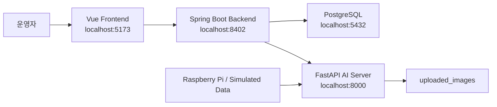
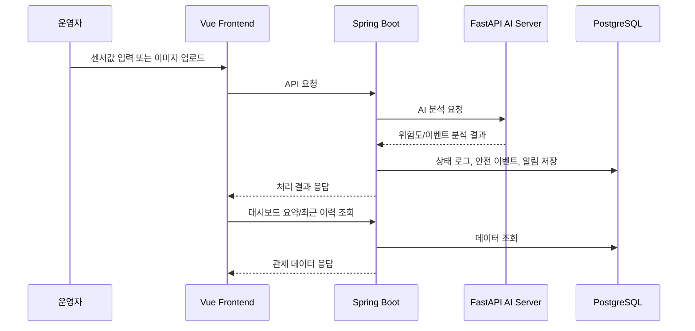

# AI 무인 셔틀 통합 안전 관제 시스템 문서 초안

## 1. 프로젝트 개요

이 프로젝트는 인천공항 내 무인 셔틀 운영 환경을 가정한 AI 기반 안전 관제 웹 시스템이다.

라즈베리파이 또는 시뮬레이션 데이터에서 장비 상태값과 이미지 데이터를 수집하고, FastAPI 기반 AI 분석 서버와 Spring Boot 백엔드를 거쳐 Vue 대시보드에서 장비 상태, 위험 이벤트, 알림 이력을 통합 조회한다.

핵심 목적은 단순 AI 모델 실험이 아니라, AI 분석 결과를 실제 운영 관제 흐름에 연결하는 것이다.

## 2. 핵심 기능

### 장비 상태 모니터링

- 장비 등록
- 온도, 진동, 소음 데이터 입력
- AI 서버를 통한 위험도 분석
- 정상, 주의, 위험, 오프라인 상태 관리
- 장비별 상태 로그 조회

### 안전 이벤트 관제

- 장비 선택 후 이미지 업로드
- FastAPI AI 서버를 통한 안전 이벤트 분석
- 안전 이벤트 유형 한글화 표시
- 이벤트 이미지, 신뢰도, 처리 상태 조회
- 처리 완료 기능

### 알림 관리

- 장비 위험도 알림과 안전 이벤트 알림 통합 조회
- 미확인/확인 완료 탭 분리
- 중요도 배지 표시
- 확인 처리 기능

### 대시보드

- 전체 장비 수, 주의 장비 수, 위험 장비 수
- 최근 위험도
- 전체/미처리 안전 이벤트 수
- 미확인 알림 수
- 최근 위험도 변화 차트
- 상태별 장비 수 차트
- 최근 알림/안전 이벤트/장비 상태 로그
- 10초 자동 갱신과 수동 새로고침

## 3. 시스템 아키텍처



## 4. 서버 구성

| 구분 | 기술 | 포트 | 역할 |
| --- | --- | --- | --- |
| Frontend | Vue 3, Vite, Bootstrap | 5173 | 관제 화면 |
| Backend | Spring Boot 3, JPA | 8402 | API, 비즈니스 로직, DB 연동 |
| AI Server | FastAPI, Python | 8000 | 장비 상태 예측, 안전 이벤트 분석 |
| Database | PostgreSQL | 5432 | 장비, 상태 로그, 이벤트, 알림 저장 |

## 5. 주요 화면

### Dashboard

접속 경로: `/dashboard`

운영자가 시스템 전체 상황을 한 화면에서 확인하는 메인 관제 화면이다.

확인 항목:

- 장비 상태 요약
- 안전 이벤트 요약
- 알림 요약
- 최근 위험도 변화
- 상태별 장비 수
- 최근 알림/이벤트/상태 로그

### Safety Events

접속 경로: `/safety-events`

AI 이미지 분석 결과를 안전 이벤트로 등록하고 처리 상태를 관리하는 화면이다.

확인 항목:

- 대상 장비 선택
- 이미지 업로드 및 미리보기
- AI 안전 분석 실행
- 이벤트 유형, 신뢰도, 이미지, 처리 상태

### Alerts

접속 경로: `/alerts`

운영자가 미확인 알림과 확인 완료 알림을 분리해서 관리하는 화면이다.

확인 항목:

- 미확인/확인 완료 탭
- 알림 유형
- 중요도
- 알림 내용
- 확인 처리

### Device Status

접속 경로: `/device-status`

장비 등록과 센서 기반 상태 로그 입력을 담당하는 화면이다.

확인 항목:

- 장비명, 장비 종류, 운행 위치 등록
- 온도, 진동, 소음 입력
- 위험도 및 판정 상태 조회

## 6. 주요 API

### Dashboard

| Method | URL | 설명 |
| --- | --- | --- |
| GET | `/api/dashboard/summary` | 대시보드 요약 정보 |
| GET | `/api/dashboard/recent` | 최근 알림, 이벤트, 상태 로그 |

### Devices

| Method | URL | 설명 |
| --- | --- | --- |
| POST | `/api/devices` | 장비 등록 |
| GET | `/api/devices` | 장비 목록 조회 |
| GET | `/api/devices/{deviceId}` | 장비 단건 조회 |
| POST | `/api/device-status` | 장비 상태 로그 등록 |
| GET | `/api/device-status/{deviceId}` | 장비별 상태 로그 조회 |

### Safety Events

| Method | URL | 설명 |
| --- | --- | --- |
| POST | `/api/safety-events` | 시나리오 기반 안전 이벤트 생성 |
| GET | `/api/safety-events` | 안전 이벤트 목록 조회 |
| GET | `/api/safety-events/device/{deviceId}` | 장비별 안전 이벤트 조회 |
| PATCH | `/api/safety-events/{eventId}/resolve` | 안전 이벤트 처리 완료 |
| POST | `/api/safety-events/image` | 이미지 기반 안전 이벤트 생성 |
| GET | `/api/safety-events/recent` | 최근 안전 이벤트 조회 |

### Alerts

| Method | URL | 설명 |
| --- | --- | --- |
| GET | `/api/alerts` | 알림 목록 조회 |
| PATCH | `/api/alerts/{alertId}/check` | 알림 확인 처리 |

## 7. 데이터 흐름



## 8. 시연 시나리오 초안

### 1단계. 서버 실행 확인

```powershell
docker compose -f docker-compose.yml -f docker-compose.dev.yml up -d
```

확인 URL:

- http://localhost:5173/dashboard
- http://localhost:8402/swagger-ui/index.html
- http://localhost:8000/docs

### 2단계. 시연 데이터 생성

```powershell
.\scripts\seed-dashboard-demo-data.ps1
```

생성되는 데이터:

- 무인 셔틀 장비 6대
- 정상/주의/위험 프로필별 상태 로그
- 안전 이벤트 시나리오
- 위험도 기반 알림

### 3단계. 대시보드 설명

설명 포인트:

- 전체 장비 상태를 카드와 차트로 요약한다.
- 최근 위험도 변화로 장비 상태 추이를 확인한다.
- 상태별 장비 수로 현재 운영 위험 수준을 파악한다.
- 최근 알림과 안전 이벤트에서 즉시 조치 대상을 확인한다.

### 4단계. 장비 상태 입력

설명 포인트:

- 온도, 진동, 소음 데이터를 입력하면 AI 서버가 위험도를 계산한다.
- 위험도가 임계치를 넘으면 장비 상태가 주의 또는 위험으로 변경된다.
- 위험 상태는 알림으로 자동 생성된다.

### 5단계. 안전 이벤트 처리

설명 포인트:

- 이미지를 업로드해 AI 안전 분석을 실행한다.
- 감지 결과는 안전 이벤트로 저장된다.
- 운영자는 이벤트를 확인하고 처리 완료 상태로 변경할 수 있다.

### 6단계. 알림 확인

설명 포인트:

- 미확인 알림과 확인 완료 알림을 탭으로 분리한다.
- 운영자는 미확인 알림을 확인 처리하여 관제 이력을 정리한다.

## 9. 현재 구현 완료 범위

- Docker Compose 기반 통합 실행
- PostgreSQL 연동
- Spring Boot DTO 기반 API 응답
- Vue 대시보드
- 장비 등록/상태 로그 입력
- 안전 이벤트 이미지 업로드
- 알림 확인 처리
- 대시보드 자동 갱신
- 시연용 더미 데이터 스크립트
- 화면 표시값 한글화

## 10. 남은 고도화 과제

### YOLO bbox 이미지 저장 고도화

- 탐지 결과 이미지에 bbox 시각화
- 원본 이미지와 분석 결과 이미지 분리 저장
- 이벤트 상세 화면에서 탐지 이미지 확인

### PHM 모델 고도화

- 현재는 시뮬레이션 기반 위험도 분석
- 추후 실제 장비 상태 데이터 기반 학습
- 시간 순서 기반 train/validation/test split
- precision, recall, F1, false alarm rate, lead time 측정

### 문서화 보강

- API 요청/응답 예시 추가
- DB ERD 추가
- 시연 영상용 대본 작성
- 트러블슈팅 기록 정리

## 11. 면접 설명용 요약

인천공항 무인 셔틀 운영 환경을 가정하여 장비 상태 데이터와 AI 안전 이벤트를 통합 관리하는 관제 시스템을 구현했습니다.

Vue 대시보드, Spring Boot API, FastAPI AI 서버, PostgreSQL을 Docker Compose로 연동했고, 장비 위험도 분석 결과와 이미지 기반 안전 이벤트를 알림 및 이력 관리 흐름으로 연결했습니다.

단순 객체탐지나 단순 CRUD가 아니라 AI 분석 결과가 운영자가 확인하고 조치할 수 있는 관제 화면까지 이어지도록 구성한 점이 핵심입니다.
