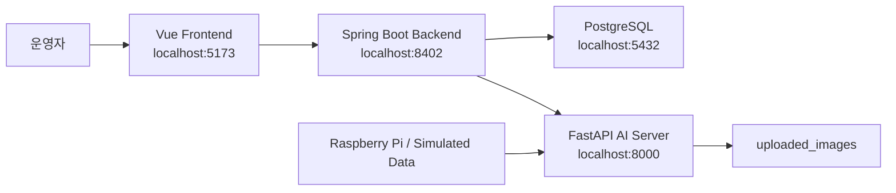
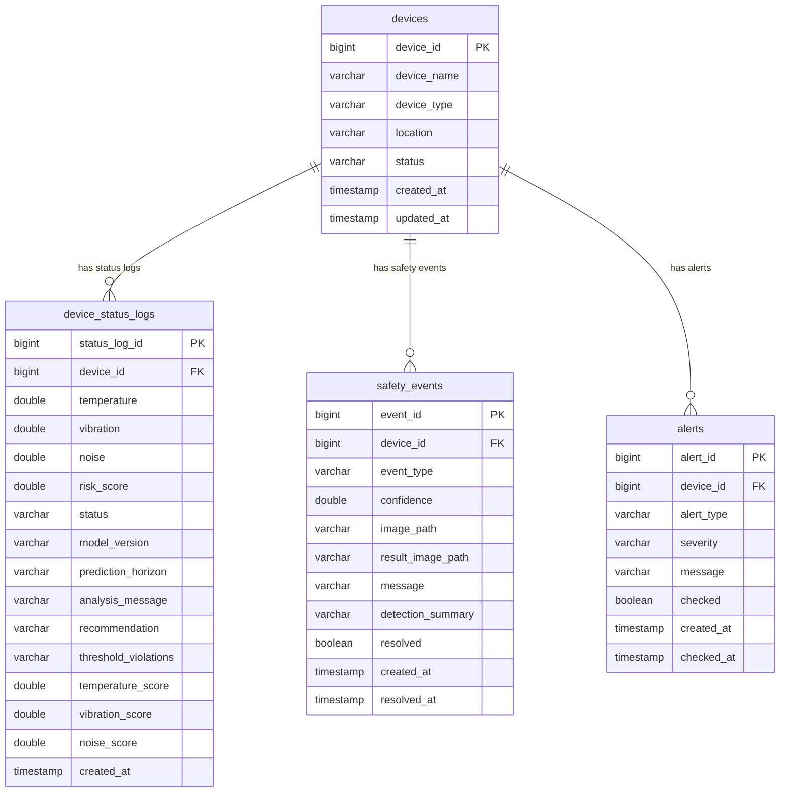
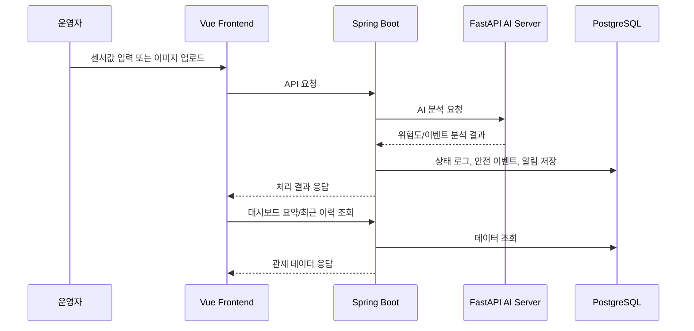

# AI 무인 셔틀 통합 안전 관제 시스템 문서 초안

## 1. 프로젝트 개요

이 프로젝트는 인천공항 내 무인 셔틀 운영 환경을 가정한 AI 기반 안전 관제 웹 시스템이다.

라즈베리파이 또는 시뮬레이션 데이터에서 장비 상태값과 이미지 데이터를 수집하고, FastAPI 기반 AI 분석 서버와 Spring Boot 백엔드를 거쳐 Vue 대시보드에서 장비 상태, 위험 이벤트, 알림 이력을 통합 조회한다.

핵심 목적은 단순 AI 모델 실험이 아니라, AI 분석 결과를 실제 운영 관제 흐름에 연결하는 것이다.

## 2. 핵심 기능

### 장비 상태 모니터링

- 장비 등록
- 온도, 진동, 소음 데이터 입력
- AI 서버를 통한 위험도 분석
- 정상, 주의, 위험, 오프라인 상태 관리
- 장비별 상태 로그 조회

### 안전 이벤트 관제

- 장비 선택 후 이미지 업로드
- FastAPI AI 서버를 통한 안전 이벤트 분석
- 안전 이벤트 유형 한글화 표시
- 이벤트 이미지, 신뢰도, 처리 상태 조회
- 처리 완료 기능

### 알림 관리

- 장비 위험도 알림과 안전 이벤트 알림 통합 조회
- 미확인/확인 완료 탭 분리
- 중요도 배지 표시
- 확인 처리 기능

### 대시보드

- 전체 장비 수, 주의 장비 수, 위험 장비 수
- 최근 위험도
- 전체/미처리 안전 이벤트 수
- 미확인 알림 수
- 최근 위험도 변화 차트
- 상태별 장비 수 차트
- 최근 알림/안전 이벤트/장비 상태 로그
- 10초 자동 갱신과 수동 새로고침

## 3. 시스템 아키텍처



## 4. 서버 구성

| 구분 | 기술 | 포트 | 역할 |
| --- | --- | --- | --- |
| Frontend | Vue 3, Vite, Bootstrap | 5173 | 관제 화면 |
| Backend | Spring Boot 3, JPA | 8402 | API, 비즈니스 로직, DB 연동 |
| AI Server | FastAPI, Python | 8000 | 장비 상태 예측, 안전 이벤트 분석 |
| Database | PostgreSQL | 5432 | 장비, 상태 로그, 이벤트, 알림 저장 |

## 5. 주요 화면

### Dashboard

접속 경로: `/dashboard`

운영자가 시스템 전체 상황을 한 화면에서 확인하는 메인 관제 화면이다.

확인 항목:

- 장비 상태 요약
- 안전 이벤트 요약
- 알림 요약
- 최근 위험도 변화
- 상태별 장비 수
- 최근 알림/이벤트/상태 로그

### Safety Events

접속 경로: `/safety-events`

AI 이미지 분석 결과를 안전 이벤트로 등록하고 처리 상태를 관리하는 화면이다.

확인 항목:

- 대상 장비 선택
- 이미지 업로드 및 미리보기
- AI 안전 분석 실행
- 이벤트 유형, 신뢰도, 이미지, 처리 상태

### Alerts

접속 경로: `/alerts`

운영자가 미확인 알림과 확인 완료 알림을 분리해서 관리하는 화면이다.

확인 항목:

- 미확인/확인 완료 탭
- 알림 유형
- 중요도
- 알림 내용
- 확인 처리

### Device Status

접속 경로: `/device-status`

장비 등록과 센서 기반 상태 로그 입력을 담당하는 화면이다.

확인 항목:

- 장비명, 장비 종류, 운행 위치 등록
- 온도, 진동, 소음 입력
- 위험도 및 판정 상태 조회
- PHM 모델 버전, feature별 위험 기여도, 이상 근거, 권장 조치 확인

## 6. 주요 API

### Dashboard

| Method | URL | 설명 |
| --- | --- | --- |
| GET | `/api/dashboard/summary` | 대시보드 요약 정보 |
| GET | `/api/dashboard/recent` | 최근 알림, 이벤트, 상태 로그 |

### Devices

| Method | URL | 설명 |
| --- | --- | --- |
| POST | `/api/devices` | 장비 등록 |
| GET | `/api/devices` | 장비 목록 조회 |
| GET | `/api/devices/{deviceId}` | 장비 단건 조회 |
| POST | `/api/device-status` | 장비 상태 로그 등록 |
| GET | `/api/device-status/{deviceId}` | 장비별 상태 로그 조회 |

### Safety Events

| Method | URL | 설명 |
| --- | --- | --- |
| POST | `/api/safety-events` | 시나리오 기반 안전 이벤트 생성 |
| GET | `/api/safety-events` | 안전 이벤트 목록 조회 |
| GET | `/api/safety-events/device/{deviceId}` | 장비별 안전 이벤트 조회 |
| PATCH | `/api/safety-events/{eventId}/resolve` | 안전 이벤트 처리 완료 |
| POST | `/api/safety-events/image` | 이미지 기반 안전 이벤트 생성 |
| GET | `/api/safety-events/recent` | 최근 안전 이벤트 조회 |

### Alerts

| Method | URL | 설명 |
| --- | --- | --- |
| GET | `/api/alerts` | 알림 목록 조회 |
| PATCH | `/api/alerts/{alertId}/check` | 알림 확인 처리 |

## 7. API 요청/응답 예시

### 장비 등록

요청:

```http
POST /api/devices
Content-Type: application/json
```

```json
{
  "deviceName": "IAT-SHUTTLE-001",
  "deviceType": "AUTONOMOUS_SHUTTLE",
  "location": "Terminal 1 Platform A"
}
```

응답:

```http
HTTP/1.1 201 Created
```

```json
1
```

### 장비 목록 조회

```http
GET /api/devices
```

```json
[
  {
    "deviceId": 1,
    "deviceName": "IAT-SHUTTLE-001",
    "deviceType": "AUTONOMOUS_SHUTTLE",
    "location": "Terminal 1 Platform A",
    "status": "NORMAL"
  }
]
```

### 장비 상태 로그 등록

요청:

```http
POST /api/device-status
Content-Type: application/json
```

```json
{
  "deviceId": 1,
  "temperature": 70.0,
  "vibration": 0.45,
  "noise": 70.0
}
```

응답:

```http
HTTP/1.1 201 Created
```

```json
15
```

처리 흐름:

1. Spring Boot가 장비 존재 여부를 확인한다.
2. FastAPI `/predict/device-status`로 온도, 진동, 소음 값을 전달한다.
3. AI 서버가 `riskScore`, `status`, `message`를 반환한다.
4. AI 서버가 `modelVersion`, `contributionScores`, `thresholdViolations`, `recommendation`을 함께 반환한다.
5. Spring Boot가 `device_status_logs`에 위험도, 모델 버전, feature별 점수, 분석 근거를 저장하고 장비의 현재 상태를 갱신한다.
6. 상태가 `WARNING` 또는 `DANGER`이면 `DEVICE_RISK` 알림을 생성한다.

### 장비 상태 로그 조회

```http
GET /api/device-status/1
```

```json
[
  {
    "statusId": 15,
    "deviceId": 1,
    "temperature": 70.0,
    "vibration": 0.45,
    "noise": 70.0,
    "riskScore": 61.3,
    "status": "WARNING",
    "modelVersion": "phm-rule-baseline-v1",
    "predictionHorizon": "IMMEDIATE_RISK",
    "analysisMessage": "장비 이상 징후가 감지되었습니다. 점검이 권장됩니다. 근거: TEMPERATURE_DANGER, NOISE_WARNING",
    "recommendation": "온도 상승 원인을 우선 확인하세요. 냉각 상태와 배터리/구동부 부하를 점검하세요.",
    "thresholdViolations": "TEMPERATURE_DANGER,NOISE_WARNING",
    "temperatureScore": 31.5,
    "vibrationScore": 13.9,
    "noiseScore": 15.9,
    "createdAt": "2026-06-05T16:30:00"
  }
]
```

### 시나리오 기반 안전 이벤트 생성

요청:

```http
POST /api/safety-events
Content-Type: application/json
```

```json
{
  "deviceId": 1,
  "scenario": "OBSTACLE"
}
```

허용 시나리오:

| 값 | 의미 |
| --- | --- |
| `FALL` | 승객 전도 감지 |
| `DOOR` | 문 끼임 위험 |
| `OBSTACLE` | 장애물 감지 |
| `DANGER_ZONE` | 위험 구역 접근 |

응답:

```http
HTTP/1.1 201 Created
```

```json
3
```

### 이미지 기반 안전 이벤트 생성

요청:

```http
POST /api/safety-events/image
Content-Type: multipart/form-data
```

| 필드 | 타입 | 설명 |
| --- | --- | --- |
| `deviceId` | number | 이벤트를 연결할 장비 ID |
| `file` | file | 분석할 이미지 파일 |

응답:

```http
HTTP/1.1 201 Created
```

```json
4
```

현재 저장되는 안전 이벤트 응답 예시:

```http
GET /api/safety-events/recent
```

```json
[
  {
    "eventId": 4,
    "deviceId": 1,
    "deviceName": "IAT-SHUTTLE-001",
    "eventType": "SAFETY_OBJECT_DETECTED",
    "confidence": 1.0,
    "imagePath": "uploaded_images/original/08f0a2f4.jpg",
    "imageUrl": "http://localhost:8000/images/original/08f0a2f4.jpg",
    "resultImagePath": "uploaded_images/results/08f0a2f4_bbox.jpg",
    "resultImageUrl": "http://localhost:8000/images/results/08f0a2f4_bbox.jpg",
    "message": "person 객체가 감지되었습니다. 안전 확인이 필요합니다.",
    "detectionSummary": "person / confidence 0.8732 / bbox[x1=120.00, y1=80.00, x2=260.00, y2=360.00]",
    "resolved": false,
    "createdAt": "2026-06-05T16:35:00",
    "resolvedAt": null
  }
]
```

### 안전 이벤트 처리 완료

```http
PATCH /api/safety-events/4/resolve
```

```http
HTTP/1.1 204 No Content
```

### 알림 목록 조회

```http
GET /api/alerts
```

```json
[
  {
    "alertId": 10,
    "deviceId": 1,
    "deviceName": "IAT-SHUTTLE-001",
    "alertType": "DEVICE_RISK",
    "severity": "WARNING",
    "message": "[IAT-SHUTTLE-001] 장비 위험도 64.2점 감지. 현재 상태: WARNING",
    "checked": false,
    "createdAt": "2026-06-05T16:30:00",
    "checkedAt": null
  }
]
```

### 알림 확인 처리

```http
PATCH /api/alerts/10/check
```

```http
HTTP/1.1 204 No Content
```

### 대시보드 요약 조회

```http
GET /api/dashboard/summary
```

```json
{
  "totalDevices": 6,
  "normalDevices": 2,
  "warningDevices": 2,
  "dangerDevices": 2,
  "offlineDevices": 0,
  "totalSafetyEvents": 6,
  "unresolvedSafetyEvents": 6,
  "totalAlerts": 16,
  "uncheckedAlerts": 16,
  "latestRiskScore": 88.4,
  "latestDeviceStatus": "DANGER"
}
```

### 대시보드 최근 이력 조회

```http
GET /api/dashboard/recent
```

```json
{
  "recentAlerts": [],
  "recentSafetyEvents": [],
  "recentDeviceStatuses": []
}
```

실제 응답에서는 각 배열에 `AlertResponseDto`, `SafetyEventResponseDto`, `DeviceStatusResponseDto` 형식의 최근 5건이 들어간다.

### FastAPI AI 서버 계약

장비 상태 분석:

```http
POST /predict/device-status
Content-Type: application/json
```

```json
{
  "deviceId": 1,
  "temperature": 70.0,
  "vibration": 0.45,
  "noise": 70.0
}
```

```json
{
  "riskScore": 61.3,
  "status": "WARNING",
  "message": "장비 이상 징후가 감지되었습니다. 점검이 권장됩니다. 근거: TEMPERATURE_DANGER, NOISE_WARNING",
  "modelVersion": "phm-rule-baseline-v1",
  "predictionHorizon": "IMMEDIATE_RISK",
  "contributionScores": {
    "temperature": 31.5,
    "vibration": 13.9,
    "noise": 15.9
  },
  "thresholdViolations": [
    "TEMPERATURE_DANGER",
    "NOISE_WARNING"
  ],
  "recommendation": "온도 상승 원인을 우선 확인하세요. 냉각 상태와 배터리/구동부 부하를 점검하세요."
}
```

시나리오 기반 안전 이벤트 분석:

```http
POST /detect/safety
Content-Type: application/json
```

```json
{
  "deviceId": 1,
  "scenario": "OBSTACLE"
}
```

```json
{
  "eventType": "OBSTACLE_DETECTED",
  "confidence": 0.86,
  "message": "통행 구역 내 이물질이 감지되었습니다.",
  "imagePath": null
}
```

이미지 기반 안전 이벤트 분석:

```http
POST /detect/safety/image
Content-Type: multipart/form-data
```

```json
{
  "eventType": "SAFETY_OBJECT_DETECTED",
  "confidence": 1.0,
  "message": "person 객체가 감지되었습니다. 안전 확인이 필요합니다.",
  "imagePath": "uploaded_images/original/08f0a2f4.jpg",
  "resultImagePath": "uploaded_images/results/08f0a2f4_bbox.jpg",
  "detections": [
    {
      "classId": 0,
      "className": "person",
      "confidence": 1.0,
      "bbox": {
        "x1": 120,
        "y1": 80,
        "x2": 260,
        "y2": 360
      }
    }
  ]
}
```

### 공통 에러 응답

검증 실패 예시:

```json
{
  "timestamp": "2026-06-05T16:40:00",
  "status": 400,
  "error": "Bad Request",
  "message": "요청 값이 올바르지 않습니다.",
  "fieldErrors": {
    "deviceName": "장비명은 필수입니다."
  }
}
```

AI 서버 호출 실패 예시:

```json
{
  "timestamp": "2026-06-05T16:40:00",
  "status": 502,
  "error": "Bad Gateway",
  "message": "AI 서버 호출 중 오류가 발생했습니다.",
  "fieldErrors": null
}
```

## 8. DB 구조와 ERD 초안

현재 구현은 JPA 엔티티 기준으로 `devices`, `device_status_logs`, `safety_events`, `alerts` 네 개의 핵심 테이블을 사용한다.

### devices

| 컬럼 | 타입 | 제약 | 설명 |
| --- | --- | --- | --- |
| `device_id` | bigint | PK, auto increment | 장비 ID |
| `device_name` | varchar(100) | not null | 장비명 |
| `device_type` | varchar(50) | not null | 장비 유형 |
| `location` | varchar(150) | not null | 운행 또는 설치 위치 |
| `status` | varchar(20) | not null | `NORMAL`, `WARNING`, `DANGER`, `OFFLINE` |
| `created_at` | timestamp | not null | 등록 시각 |
| `updated_at` | timestamp | nullable | 수정 시각 |

### device_status_logs

| 컬럼 | 타입 | 제약 | 설명 |
| --- | --- | --- | --- |
| `status_log_id` | bigint | PK, auto increment | 상태 로그 ID |
| `device_id` | bigint | FK, not null | 장비 ID |
| `temperature` | double precision | not null | 온도 |
| `vibration` | double precision | not null | 진동 |
| `noise` | double precision | not null | 소음 |
| `risk_score` | double precision | not null | AI 서버가 계산한 위험도 |
| `status` | varchar(20) | not null | `NORMAL`, `WARNING`, `DANGER`, `OFFLINE` |
| `model_version` | varchar(80) | nullable | PHM 모델 또는 baseline 버전 |
| `prediction_horizon` | varchar(50) | nullable | 예측 기준 구간. 현재는 `IMMEDIATE_RISK` |
| `analysis_message` | varchar(700) | nullable | AI 분석 메시지 |
| `recommendation` | varchar(700) | nullable | 운영자 권장 조치 |
| `threshold_violations` | varchar(500) | nullable | 기준 초과 코드 목록 |
| `temperature_score` | double precision | nullable | 온도 feature 위험 기여도 |
| `vibration_score` | double precision | nullable | 진동 feature 위험 기여도 |
| `noise_score` | double precision | nullable | 소음 feature 위험 기여도 |
| `created_at` | timestamp | not null | 생성 시각 |

### safety_events

| 컬럼 | 타입 | 제약 | 설명 |
| --- | --- | --- | --- |
| `event_id` | bigint | PK, auto increment | 안전 이벤트 ID |
| `device_id` | bigint | FK, not null | 장비 ID |
| `event_type` | varchar(40) | not null | 안전 이벤트 유형 |
| `confidence` | double precision | not null | AI 분석 신뢰도 |
| `image_path` | varchar(500) | nullable | AI 서버 원본 이미지 저장 경로 |
| `result_image_path` | varchar(500) | nullable | bbox가 그려진 분석 결과 이미지 저장 경로 |
| `message` | varchar(500) | not null | 운영자 표시 메시지 |
| `detection_summary` | varchar(2000) | nullable | class, confidence, bbox 좌표 요약 |
| `resolved` | boolean | not null | 처리 완료 여부 |
| `created_at` | timestamp | not null | 이벤트 생성 시각 |
| `resolved_at` | timestamp | nullable | 처리 완료 시각 |

### alerts

| 컬럼 | 타입 | 제약 | 설명 |
| --- | --- | --- | --- |
| `alert_id` | bigint | PK, auto increment | 알림 ID |
| `device_id` | bigint | FK, nullable | 연결 장비 ID |
| `alert_type` | varchar(30) | not null | `DEVICE_RISK`, `SAFETY_EVENT`, `SYSTEM` |
| `severity` | varchar(20) | not null | `INFO`, `WARNING`, `CRITICAL` |
| `message` | varchar(500) | not null | 알림 메시지 |
| `checked` | boolean | not null | 확인 여부 |
| `created_at` | timestamp | not null | 알림 생성 시각 |
| `checked_at` | timestamp | nullable | 확인 시각 |

### ERD



### enum 계약

| 구분 | 값 |
| --- | --- |
| 장비 상태 | `NORMAL`, `WARNING`, `DANGER`, `OFFLINE` |
| 안전 이벤트 | `FALL_DETECTED`, `DOOR_ENTRAPMENT`, `OBSTACLE_DETECTED`, `DANGER_ZONE_ACCESS`, `SAFETY_OBJECT_DETECTED` |
| 알림 유형 | `DEVICE_RISK`, `SAFETY_EVENT`, `SYSTEM` |
| 알림 중요도 | `INFO`, `WARNING`, `CRITICAL` |

일시 필드는 현재 `LocalDateTime` 기반 ISO-8601 형태로 응답한다. 예: `2026-06-05T16:30:00`.

## 9. 데이터 흐름



## 10. 시연 시나리오

### 1단계. 서버 실행 확인

```powershell
docker compose -f docker-compose.yml -f docker-compose.dev.yml up -d
```

확인 URL:

- http://localhost:5173/dashboard
- http://localhost:8402/swagger-ui/index.html
- http://localhost:8000/docs

설명 멘트:

> Docker Compose로 PostgreSQL, FastAPI AI 서버, Spring Boot 백엔드, Vue 프론트엔드를 함께 실행했습니다. 운영 환경에서는 각 서비스가 분리되어도 API 계약으로 연동될 수 있도록 구성했습니다.

### 2단계. 시연 데이터 생성

```powershell
.\scripts\seed-dashboard-demo-data.ps1
```

생성되는 데이터:

- 무인 셔틀 장비 6대
- 정상/주의/위험 프로필별 상태 로그
- 안전 이벤트 시나리오
- 위험도 기반 알림

설명 멘트:

> 시연 스크립트는 장비 6대를 등록하고 정상, 주의, 위험 상태가 섞이도록 센서 로그를 생성합니다. 이후 안전 이벤트를 함께 생성해 대시보드에서 운영자가 조치해야 할 항목을 확인할 수 있게 합니다.

### 3단계. 대시보드 설명

설명 포인트:

- 전체 장비 상태를 카드와 차트로 요약한다.
- 최근 위험도 변화로 장비 상태 추이를 확인한다.
- 상태별 장비 수로 현재 운영 위험 수준을 파악한다.
- 최근 알림과 안전 이벤트에서 즉시 조치 대상을 확인한다.

시연 순서:

1. `/dashboard`에 접속한다.
2. 전체 장비 수, 주의/위험 장비 수, 미확인 알림 수를 확인한다.
3. 최근 위험도 변화 차트와 상태별 장비 수 차트를 설명한다.
4. 최근 알림, 최근 안전 이벤트, 최근 장비 상태 로그가 같은 운영 흐름 안에 묶여 있음을 보여준다.

설명 멘트:

> 이 화면은 단순 통계 화면이 아니라 운영자가 오늘 어떤 장비와 이벤트를 먼저 봐야 하는지 판단하는 관제 화면입니다. 위험도, 이벤트, 알림을 한 화면에 모아 조치 우선순위를 빠르게 볼 수 있게 했습니다.

### 4단계. 장비 상태 입력

설명 포인트:

- 온도, 진동, 소음 데이터를 입력하면 AI 서버가 위험도를 계산한다.
- 위험도가 임계치를 넘으면 장비 상태가 주의 또는 위험으로 변경된다.
- 위험 상태는 알림으로 자동 생성된다.

시연 순서:

1. `/device-status`로 이동한다.
2. 장비를 선택하거나 신규 장비를 등록한다.
3. 온도, 진동, 소음 값을 입력한다.
4. 저장 후 상태 로그와 장비 상태가 갱신되는지 확인한다.
5. `/alerts` 또는 `/dashboard`에서 위험도 알림이 생성되었는지 확인한다.

설명 멘트:

> 센서 입력은 Spring Boot에 바로 저장하지 않고 FastAPI AI 서버에서 위험도를 계산한 뒤 저장합니다. 이 구조 덕분에 나중에 rule 기반 분석을 실제 PHM 모델로 교체해도 API 계약을 유지할 수 있습니다.

### 5단계. 안전 이벤트 처리

설명 포인트:

- 이미지를 업로드해 AI 안전 분석을 실행한다.
- 감지 결과는 안전 이벤트로 저장된다.
- 운영자는 이벤트를 확인하고 처리 완료 상태로 변경할 수 있다.

시연 순서:

1. `/safety-events`로 이동한다.
2. 장비를 선택하고 이미지를 업로드한다.
3. AI 안전 분석을 실행한다.
4. 이벤트 유형, 신뢰도, 이미지 URL, 처리 상태를 확인한다.
5. 처리 완료 버튼으로 이벤트를 `resolved=true` 상태로 변경한다.

설명 멘트:

> 이미지 분석 결과는 단순히 화면에 출력하는 데서 끝나지 않고 안전 이벤트 이력으로 저장됩니다. 운영자는 이벤트를 확인하고 처리 완료 상태로 남길 수 있어 관제 이력 관리가 가능합니다.

### 6단계. 알림 확인

설명 포인트:

- 미확인 알림과 확인 완료 알림을 탭으로 분리한다.
- 운영자는 미확인 알림을 확인 처리하여 관제 이력을 정리한다.

시연 순서:

1. `/alerts`로 이동한다.
2. 미확인 탭에서 위험도 또는 안전 이벤트 알림을 확인한다.
3. 중요도 배지를 기준으로 우선순위를 설명한다.
4. 확인 처리 후 확인 완료 탭으로 이동했는지 확인한다.

설명 멘트:

> 알림은 운영자가 실제로 확인했는지를 남기는 장치입니다. 반복 장애나 위험 이벤트를 단순 로그가 아니라 조치 가능한 업무 흐름으로 만들기 위한 기본 구조입니다.

### 7단계. 마무리 설명

마무리 멘트:

> 이 프로젝트의 핵심은 AI 모델 자체보다 AI 분석 결과가 운영자가 조치할 수 있는 이벤트, 알림, 대시보드 흐름으로 이어진다는 점입니다. 이후에는 bbox 결과 이미지 저장과 PHM 모델 고도화를 통해 실제 현장 관제 시스템에 더 가까운 형태로 확장할 수 있습니다.

## 11. 운영 확인 체크리스트

### Docker 실행

```powershell
docker compose -f docker-compose.yml -f docker-compose.dev.yml up -d
```

확인 항목:

- `iat-ai-phm-postgres` 컨테이너 running
- `iat-ai-server` 컨테이너 running
- `iat-backend` 컨테이너 running
- `iat-frontend` 컨테이너 running

### 시드 데이터 생성

```powershell
.\scripts\seed-dashboard-demo-data.ps1
```

확인 항목:

- PowerShell 출력에 `Demo seed completed.` 표시
- `/dashboard`에서 장비 수와 알림 수 증가
- `/safety-events`에서 이벤트 목록 표시
- `/alerts`에서 미확인 알림 표시

### 화면 확인

| 화면 | 경로 | 확인 항목 |
| --- | --- | --- |
| Dashboard | `/dashboard` | 요약 카드, 차트, 최근 이력 |
| Device Status | `/device-status` | 장비 등록, 상태 로그 입력, PHM 분석 근거 |
| Safety Events | `/safety-events` | 이미지 업로드, 원본/분석 이미지, 상세 모달, 이벤트 처리 완료 |
| Alerts | `/alerts` | 미확인/확인 완료 탭, 상세 모달, 확인 처리 |

자세한 장애 대응은 [트러블슈팅 문서](./troubleshooting.md)를 참고한다.

## 12. 현재 구현 완료 범위

- Docker Compose 기반 통합 실행
- PostgreSQL 연동
- Spring Boot DTO 기반 API 응답
- Vue 대시보드
- 장비 등록/상태 로그 입력
- 안전 이벤트 이미지 업로드
- 알림 확인 처리
- 대시보드 자동 갱신
- 시연용 더미 데이터 스크립트
- 화면 표시값 한글화

## 13. 남은 고도화 과제

### YOLO bbox 이미지 저장 고도화

- 원본 이미지를 `uploaded_images/original`에 저장
- bbox 결과 이미지를 `uploaded_images/results`에 저장
- Spring Boot 안전 이벤트 응답에 `resultImagePath`, `resultImageUrl` 추가
- Vue 안전 이벤트 목록에서 원본/분석 이미지 썸네일 표시
- Safety Events 상세 모달에서 detection class, confidence, bbox 좌표 표시

### PHM 모델 고도화

- 현재는 `phm-rule-baseline-v1` 기반 설명 가능한 rule baseline
- 입력 feature: `deviceId`, `temperature`, `vibration`, `noise`
- 응답 계약: `riskScore`, `status`, `modelVersion`, `predictionHorizon`, `contributionScores`, `thresholdViolations`, `recommendation`
- Spring Boot 상태 로그에 모델 버전, feature별 위험 기여도, 분석 근거, 권장 조치 저장
- Vue Device Status 화면에서 feature별 점수와 권장 조치 표시
- 추후 실제 장비 상태 데이터 기반 학습
- 시간 순서 기반 train/validation/test split
- precision, recall, F1, false alarm rate, lead time 측정

### 화면/운영성 개선

- Safety Events 상세 모달 추가
- Alerts 상세 모달 추가
- 대시보드 최근 안전 이벤트에서 bbox 분석 결과 이미지를 우선 표시
- 대시보드 최근 장비 상태 로그에 PHM 모델 버전과 권장 조치 표시
- 운영자가 원본 메시지와 가공된 운영자용 메시지를 구분해 볼 수 있도록 정리

### 문서화 보강

- API 요청/응답 예시 추가
- DB ERD 추가
- 시연 영상용 대본 작성
- 트러블슈팅 기록 정리

## 14. 면접 설명용 요약

인천공항 무인 셔틀 운영 환경을 가정하여 장비 상태 데이터와 AI 안전 이벤트를 통합 관리하는 관제 시스템을 구현했습니다.

Vue 대시보드, Spring Boot API, FastAPI AI 서버, PostgreSQL을 Docker Compose로 연동했고, 장비 위험도 분석 결과와 이미지 기반 안전 이벤트를 알림 및 이력 관리 흐름으로 연결했습니다.

단순 객체탐지나 단순 CRUD가 아니라 AI 분석 결과가 운영자가 확인하고 조치할 수 있는 관제 화면까지 이어지도록 구성한 점이 핵심입니다.
