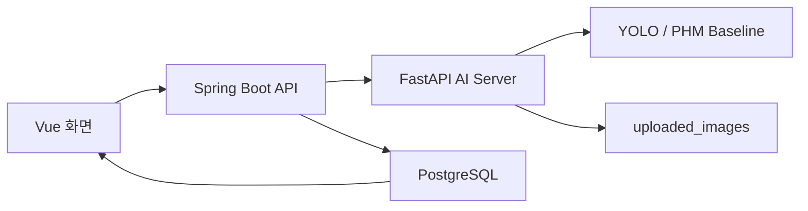

# 2026-06-05 구현 학습 노트

오늘 작업은 단순 기능 추가보다, AI 분석 결과를 운영자가 확인하고 조치할 수 있는 관제 흐름으로 정리한 것이 핵심이다.

## 1. 전체 흐름



핵심 포인트:

- AI 서버는 분석 결과를 만든다.
- Spring Boot는 분석 결과를 운영 이벤트와 이력으로 저장한다.
- Vue는 운영자가 판단할 수 있는 형태로 보여준다.
- 문서와 TODO는 현재 API 계약과 다음 개발 기준을 고정한다.

## 2. YOLO bbox 이미지 저장 로직

### 문제

기존에는 이미지 업로드 후 원본 이미지만 저장했다.

운영자 입장에서는 다음 질문에 답하기 어렵다.

- AI가 이미지 어디를 보고 이벤트를 만들었는가?
- 어떤 객체가 몇 % 신뢰도로 탐지되었는가?
- 오탐/미탐을 나중에 확인할 수 있는가?

### 개선 흐름

```text
이미지 업로드
-> original 디렉터리에 원본 저장
-> YOLO 탐지 실행
-> bbox 좌표를 이미지 위에 그림
-> results 디렉터리에 분석 결과 이미지 저장
-> Spring Boot에 imagePath/resultImagePath/detectionSummary 저장
-> Vue에서 원본/분석 이미지와 탐지 상세 표시
```

### 핵심 코드

FastAPI 저장 경로 분리:

```python
UPLOAD_DIR = Path("uploaded_images")
ORIGINAL_IMAGE_DIR = UPLOAD_DIR / "original"
RESULT_IMAGE_DIR = UPLOAD_DIR / "results"

ORIGINAL_IMAGE_DIR.mkdir(parents=True, exist_ok=True)
RESULT_IMAGE_DIR.mkdir(parents=True, exist_ok=True)
```

OpenCV bbox 그리기:

```python
cv2.rectangle(image, (x1, y1), (x2, y2), (0, 180, 255), 2)
cv2.putText(
    image,
    label,
    (x1, max(y1 - 8, 20)),
    cv2.FONT_HERSHEY_SIMPLEX,
    0.6,
    (0, 180, 255),
    2,
    cv2.LINE_AA
)
```

신뢰도 보존:

```python
"confidence": round(confidence, 4)
```

기존의 `round(confidence)`는 `0.8732`를 `1`로 만들 수 있다.  
AI 결과를 운영 판단에 쓰려면 소수점 신뢰도를 보존하는 편이 낫다.

### 저장 데이터

```text
imagePath         = uploaded_images/original/{uuid}.jpg
resultImagePath   = uploaded_images/results/{uuid}_bbox.jpg
detectionSummary  = person / confidence 0.8732 / bbox[x1=..., y1=..., x2=..., y2=...]
```

## 3. PHM rule baseline 고도화

### 문제

기존 PHM은 다음처럼 위험도 숫자 하나만 만들었다.

```python
risk_score = temperature * 0.8 + vibration * 40.0 + noise * 0.3
```

이 방식은 간단하지만 운영자에게 설명력이 부족하다.

- 왜 위험인가?
- 어떤 feature가 가장 크게 기여했는가?
- 어떤 조치를 해야 하는가?
- 나중에 실제 ML 모델로 교체할 기준이 있는가?

### 개선 방향

이번에는 실제 학습 모델을 넣기보다, 설명 가능한 baseline으로 정리했다.

```text
입력 feature
-> feature별 정규화 점수
-> 총 위험도
-> 상태 판정
-> threshold 위반 코드
-> 권장 조치
```

### PHM 모델 버전

```python
MODEL_VERSION = "phm-rule-baseline-v1"
PREDICTION_HORIZON = "IMMEDIATE_RISK"
```

모델 버전을 응답과 DB에 남기는 이유:

- 나중에 모델 산식이 바뀌어도 이전 로그가 어떤 기준으로 생성되었는지 추적할 수 있다.
- rule baseline, scikit-learn, XGBoost, ONNX 모델을 교체할 때 같은 API 계약을 유지할 수 있다.

### feature별 기여도 계산

```python
FEATURE_WEIGHTS = {
    "temperature": 35.0,
    "vibration": 40.0,
    "noise": 25.0,
}

FEATURE_RANGES = {
    "temperature": {"min": 25.0, "max": 75.0},
    "vibration": {"min": 0.05, "max": 1.20},
    "noise": {"min": 35.0, "max": 90.0},
}
```

정규화 로직:

```python
normalized_value = (value - feature_range["min"]) / (feature_range["max"] - feature_range["min"])
bounded_value = min(1.0, max(0.0, normalized_value))
feature_score = bounded_value * weight
```

이 구조는 각 센서 단위가 달라도 같은 위험도 스케일로 합산하기 위한 장치다.

### threshold 위반 코드

```python
THRESHOLDS = {
    "temperature": {"warning": 45.0, "danger": 60.0},
    "vibration": {"warning": 0.50, "danger": 0.90},
    "noise": {"warning": 60.0, "danger": 75.0},
}
```

예시:

```text
temperature = 70.0 -> TEMPERATURE_DANGER
noise = 70.0       -> NOISE_WARNING
```

이 코드는 운영 메시지와 권장 조치의 근거가 된다.

### 응답 계약

```json
{
  "riskScore": 61.3,
  "status": "WARNING",
  "message": "장비 이상 징후가 감지되었습니다. 점검이 권장됩니다. 근거: TEMPERATURE_DANGER, NOISE_WARNING",
  "modelVersion": "phm-rule-baseline-v1",
  "predictionHorizon": "IMMEDIATE_RISK",
  "contributionScores": {
    "temperature": 31.5,
    "vibration": 13.9,
    "noise": 15.9
  },
  "thresholdViolations": [
    "TEMPERATURE_DANGER",
    "NOISE_WARNING"
  ],
  "recommendation": "온도 상승 원인을 우선 확인하세요. 냉각 상태와 배터리/구동부 부하를 점검하세요."
}
```

## 4. Spring Boot 저장 로직

### 역할

Spring Boot는 AI 결과를 단순 전달하지 않는다.  
운영 이력으로 저장하고, 화면이 조회할 수 있는 DTO로 변환한다.

### DeviceStatusLog 확장

```java
private String modelVersion;
private String predictionHorizon;
private String analysisMessage;
private String recommendation;
private String thresholdViolations;
private Double temperatureScore;
private Double vibrationScore;
private Double noiseScore;
```

이 필드들이 필요한 이유:

- 장애 판단 기준을 나중에 추적할 수 있다.
- 운영자가 어떤 조치를 해야 하는지 화면에서 바로 볼 수 있다.
- 이후 실제 ML 모델로 바꿔도 저장 구조가 유지된다.

### AI 응답 저장

```java
DeviceStatusLog statusLog = DeviceStatusLog.builder()
        .device(device)
        .temperature(requestDto.getTemperature())
        .vibration(requestDto.getVibration())
        .noise(requestDto.getNoise())
        .riskScore(riskScore)
        .status(status)
        .modelVersion(aiResult.getModelVersion())
        .predictionHorizon(aiResult.getPredictionHorizon())
        .analysisMessage(aiResult.getMessage())
        .recommendation(aiResult.getRecommendation())
        .thresholdViolations(formatThresholdViolations(aiResult.getThresholdViolations()))
        .temperatureScore(getContributionScore(aiResult.getContributionScores(), "temperature"))
        .vibrationScore(getContributionScore(aiResult.getContributionScores(), "vibration"))
        .noiseScore(getContributionScore(aiResult.getContributionScores(), "noise"))
        .build();
```

### 알림 생성 기준

```java
if (status == DeviceStatusType.WARNING || status == DeviceStatusType.DANGER) {
    createDeviceRiskAlert(device, riskScore, status);
}
```

운영 시스템에서는 분석 결과가 위험이면 끝이 아니라, 알림과 조치 흐름으로 이어져야 한다.

## 5. Vue 운영 화면 로직

### Safety Events

목록에서 바로 보는 정보:

- 이벤트 ID
- 장비명
- 이벤트 유형
- 신뢰도
- 처리 상태
- 원본/분석 이미지 썸네일

상세 모달에서 보는 정보:

- 원본 메시지
- 원본/분석 이미지
- detection class
- confidence
- bbox 좌표
- 처리 완료 버튼

이미지 배열 생성:

```js
const eventImages = (event) => {
  return [
    { label: "원본", url: event.imageUrl },
    { label: "분석", url: event.resultImageUrl },
  ].filter((image) => image.url);
};
```

상세 detection 표시:

```js
const detectionSummaryLines = (event) => {
  if (!event?.detectionSummary) return ["탐지 상세 정보가 없습니다."];

  return event.detectionSummary
    .split("\n")
    .filter(Boolean);
};
```

### Device Status

상태 로그 화면에 추가된 정보:

- PHM 모델 버전
- 예측 기준 구간
- feature별 위험 기여도
- threshold 위반 항목
- 권장 조치

threshold 한글화:

```js
const thresholdViolationLabels = {
  TEMPERATURE_WARNING: "온도 주의",
  TEMPERATURE_DANGER: "온도 위험",
  VIBRATION_WARNING: "진동 주의",
  VIBRATION_DANGER: "진동 위험",
  NOISE_WARNING: "소음 주의",
  NOISE_DANGER: "소음 위험",
};
```

### Alerts

상세 모달에서 원본 메시지와 운영자용 메시지를 분리했다.

```text
운영자 메시지: 화면에서 읽기 쉽게 가공한 설명
원본 메시지: backend가 생성해 DB에 저장한 실제 알림 메시지
```

이 구분은 문제 분석에 중요하다. 화면 표시만 바뀐 것인지, 실제 저장된 메시지가 잘못된 것인지 구분할 수 있기 때문이다.

## 6. 실무 관점에서 중요한 설계 포인트

### 1. AI 결과는 설명 가능해야 한다

위험도 숫자만 있으면 운영자가 움직이기 어렵다.

좋은 응답은 다음을 포함한다.

```text
점수
판정 상태
근거
권장 조치
모델 버전
입력 feature
```

### 2. 원본과 분석 결과를 둘 다 남긴다

YOLO 이미지 분석에서는 원본과 bbox 결과 이미지를 둘 다 저장해야 한다.

```text
원본: 나중에 재분석 가능
결과: 운영자가 즉시 판단 가능
```

### 3. 모델 버전을 저장한다

모델이나 rule이 바뀌면 같은 입력도 다른 결과가 나올 수 있다.  
그래서 운영 로그에는 반드시 모델 버전이 남아야 한다.

### 4. DTO로 API 계약을 고정한다

JPA Entity를 그대로 응답하지 않고 DTO를 사용했다.

```text
Entity: DB 저장 구조
DTO: API 응답 계약
```

이 분리는 나중에 DB 컬럼이 바뀌어도 프론트 계약을 안정적으로 유지하게 해준다.

### 5. 운영 화면은 목록 + 상세 구조가 좋다

목록은 빠른 판단용이고, 상세는 근거 확인용이다.

```text
목록: 상태, 유형, 시간, 처리 버튼
상세: 원본 메시지, 분석 이미지, bbox, 권장 조치
```

## 7. 다음 학습/개발 포인트

### PHM 실제 모델화

다음 단계는 rule baseline을 학습 모델로 바꾸는 것이다.

필요한 설계:

```text
dataset grain: deviceId + sampledAt
features: temperature, vibration, noise, rolling mean, rolling std
label: NORMAL / WARNING / DANGER 또는 failureWithinHorizon
split: time-aware train/validation/test
metrics: precision, recall, F1, PR-AUC, false alarm rate, lead time
artifact: models/phm_xgb_v1.pkl 또는 models/phm_xgb_v1.onnx
```

### Safety Event 상세 고도화

현재 detection은 문자열 요약으로 저장한다.  
추후에는 JSON 컬럼 또는 별도 DetectionBox 테이블로 분리할 수 있다.

후보 구조:

```text
safety_event_detections
- detection_id
- event_id
- class_id
- class_name
- confidence
- x1
- y1
- x2
- y2
```

별도 테이블로 분리하면 class별 통계, 오탐 분석, confidence 분포 분석이 쉬워진다.

## 8. 오늘 작업을 한 문장으로 설명하기

> AI 분석 결과를 단순히 점수나 이미지로 출력하는 데서 끝내지 않고, 원본/분석 결과 이미지, 모델 버전, feature별 근거, 권장 조치, 상세 모달까지 연결해 운영자가 확인하고 조치할 수 있는 관제 흐름으로 고도화했다.
